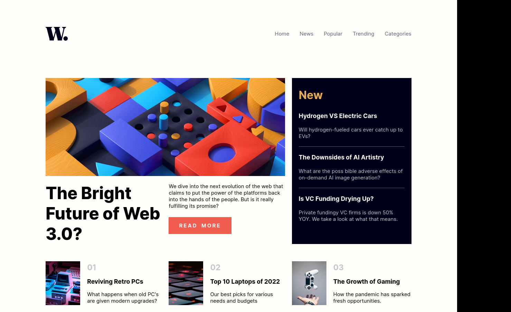
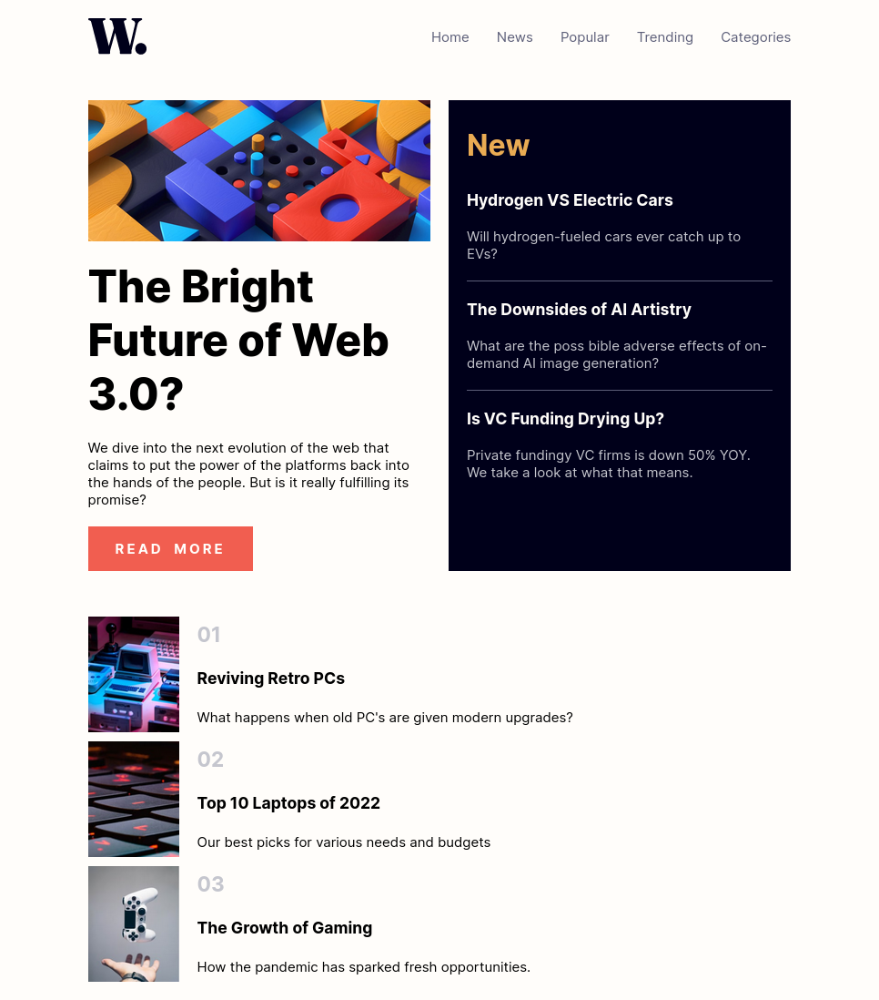

# Frontend Mentor - QR code component solution

This is a solution to the [News homepage challenge on Frontend Mentor](https://www.frontendmentor.io/challenges/news-homepage-H6SWTa1MFl).

## Table of contents

- [Overview](#overview)
  - [Screenshot](#screenshot)
  - [Links](#links)
  - [Built with](#built-with)

## Overview

A news homepage with different layouts based
on device width/screen size coded for a Frontend Mentor
challenge

### Screenshot

### Links

- Solution URL: [Solution]()
- Live Site URL: [Live Site]()

### Built with

- Semantic HTML5 Markup
- CSS Grid
- CSS Flexbox
- CSS Custom Properties
- CSS Media Queries

## Author

- Omni23 - [@omni23](https://www.frontendmentor.io/profile/omni23)
